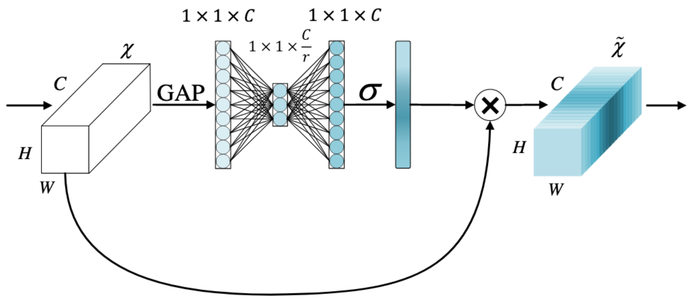
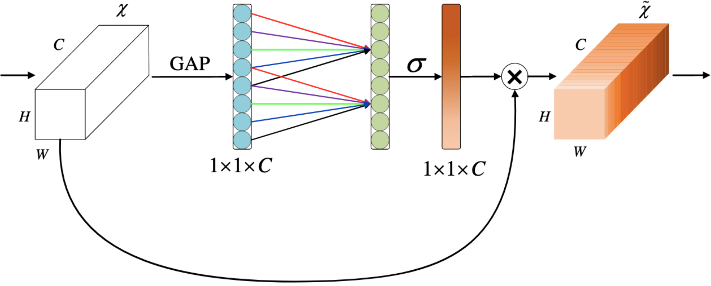
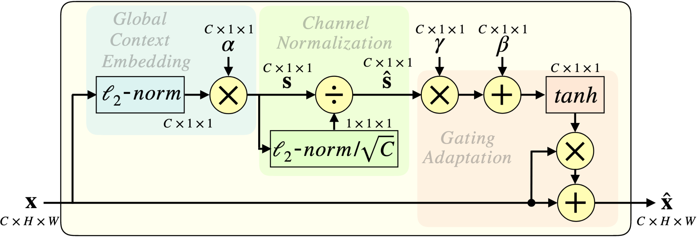

# channel-attention
Gluon implementation of some channel attention modules.
<table>
<thead>
  <tr>
    <th>Method</th>
    <th>Paper<br></th>
    <th>Overview</th>
  </tr>
</thead>
<tbody>
  <tr>
    <td>SE</td>
    <td>https://arxiv.org/abs/1709.01507</td>
    <td></td>
  </tr>
  <tr>
    <td>ECA</td>
    <td>https://arxiv.org/abs/1910.03151</td>
    <td></td>
  </tr>
  <tr>
    <td>GCT</td>
    <td>https://arxiv.org/abs/1909.11519</td>
    <td></td>
  </tr>
</tbody>
</table>

## CIFAR-10 experiments

### Usage
Example of training *resnet20_v1* with *ECA*:<br/>
```
python3 train_cifar10.py --mode hybrid --num-gpus 1 -j 8 --batch-size 128 --num-epochs 186 --lr 0.003 --lr-decay 0.1 --lr-decay-epoch 81,122 --wd 0.0001 --optimizer adam --random-crop --model cifar_resnet20_v1 --attention eca
```

### Results: validation loss and accuracy
<table>
<thead>
  <tr>
    <th rowspan="2">Model</th>
    <th colspan="2">Vanilla<br></th>
    <th colspan="2">SE</th>
    <th colspan="2">ECA</th>
    <th colspan="2">GCT</th>
  </tr>
  <tr>
    <td align="center">loss<br></td>
    <td align="center">acc</td>
    <td align="center">loss</td>
    <td align="center">acc</td>
    <td align="center">loss</td>
    <td align="center">acc</td>
    <td align="center">loss</td>
    <td align="center">acc</td>
  </tr>
</thead>
<tbody>
  <tr>
    <td>cifar_resnet20_v1</td>
    <td align="center">0.0344</span></td>
    <td align="center">0.9171</span></td>
    <td align="center">0.0325</span></td>
    <td align="center">0.9161</span></td>
    <td align="center">0.0302</span></td>
    <td align="center">0.9189</span></td>
    <td align="center">0.0292</span></td>
    <td align="center">0.9150</span></td>
  </tr>
  <tr>
    <td>cifar_resnet20_v2</span></td>
    <td align="center">0.1088</span></td>
    <td align="center">0.9133</span></td>
    <td align="center">0.0316</span></td>
    <td align="center">0.9162</span></td>
    <td align="center">0.0328</span></td>
    <td align="center">0.9194</span></td>
    <td align="center">0.0354</span></td>
    <td align="center">0.9172</span></td>
  </tr>
  <tr>
    <td>cifar_resnet56_v1</span></td>
    <td align="center">0.0431</span></td>
    <td align="center">0.9154</span></td>
    <td align="center">0.0280</span></td>
    <td align="center">0.9238</span></td>
    <td align="center">0.0170</span></td>
    <td align="center">0.9243</span></td>
    <td align="center">0.0244</span></td>
    <td align="center">0.9238</span></td>
  </tr>
  <tr>
    <td>cifar_resnet56_v2</span></td>
    <td align="center">0.0629</span></td>
    <td align="center">0.9165</span></td>
    <td align="center">0.0268</span></td>
    <td align="center">0.9243</span></td>
    <td align="center">0.0235</span></td>
    <td align="center">0.9218</span></td>
    <td align="center">0.0330</span></td>
    <td align="center">0.9200</span></td>
  </tr>
</tbody>
</table>
